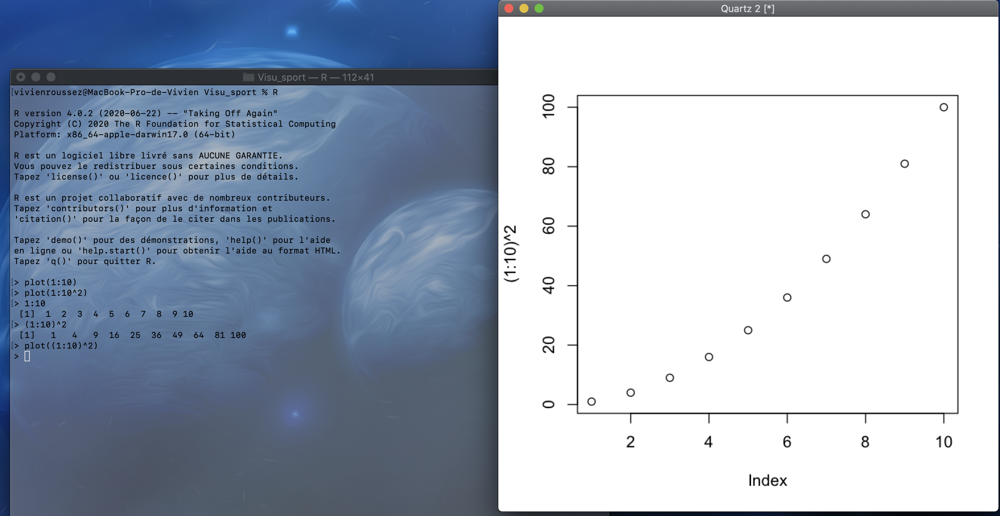

# Introduction to R {#intro_r}

R is one of the most popular data science language along with Python and Julia 

## What is R 

### Description

R is an open source programming language initially dedicated to **statistics** and **data analysis**. It is the open-source version of the original S/S-plus language, developed by Bell labs a looong time ago. It was developed in the late 90's. Being open-source, the number of **packages** available is considerable, generating both completeness and confusion. 

R is a functional programming language, meaning that **functions** are at the very core of its usage. It is not a object-oriented language although there are classes, but which are mainly hidden from the end-user.

THe basic R is a command line interface, pretty similar to the bash 


It is an **interactive** language, meaning you can execute commands one after the other, no compilation is needed to execute a sequence of commands and you can try / adjust yourt code on the fly $\rightarrow$ very flexible (like IPython)
Another very interesting characteristic of the language is that it is by design **vectorized**, meaning operations are executed at once on vectors, without explicit loops, which makes it very effective (as long as you don't loop...)

### (Objective) comparison with Pyhton

What they have in common :

- Both language are open source and come with a wide set of capabilities and a community
- Interactivity
- Data science development environment (Jupyter)
- Several ways to achieve the same task

What differs :

- R is dedicated to data / python is a generic programming language
- Functional vs object oriented
- Analysis (R) vs final product (Py) orientation


### What can I do with R 

R's core relies in data manipulation and statistical analysis. But the community made it grow in many directions 

- Read data from multiple sources (excel, text files, databases, big data infrastructures...)
- [Machine learning](https://rviews.rstudio.com/2019/06/19/a-gentle-intro-to-tidymodels/) and [deep learning](https://keras.rstudio.com/)
- [Data visualization](https://www.r-graph-gallery.com/) 
- [Communication](https://shiny.rstudio.com/gallery/) 
- [Publications](https://bookdown.org/home/)
- ... Usages I probably have no idea about !!

### Quick presentation of the ecosystem

The core functionalities are available with base R on [CRAN](https://cran.r-project.org/). On top of that, you can install several IDEs, the most popular ones being [Rstudio](https://rstudio.com/), [jupyter](https://jupyter.org/) or [VSCode](https://code.visualstudio.com/)

For this training, we will use the [R kernel](https://code.visualstudio.com/) of google collabs, but for many purposes, you'll have to use another IDE (shiny, markdown...). This kernel comes with basics packages AND the **tidyverse**

To add features to R, you'll have then to install [**packages**](https://cran.r-project.org/). Generally, when facing a problem (eg : I have to implement a naive Bayes estimator), you google it adding r at the beginning of the query and you'll get the name of the packages that allow you to do that. Then you can install and activate it.

```{r}
# install.packages("e1071")
library(e1071)
```

**Note :** You can also call functions from an installed package without loading the whole package with `::`. You might prefer this solution in several cases :

- You use only one function from the package only once $\rightarrow$ maybe not necessary to load everything
- Function names can be common across packages (eg: `intersect`, `summarise`...) using `::` ensures you are using the function from the package you meant.
- Drawback : when not appearing at the beginning of the script, it can be unseen (for a new user) that the script requires such package to be installed

```{r}
dplyr::summarise(iris,n_species=dplyr::n_distinct(Species))
```


To find more information about R and its functinalities / latest news :

- [R bloggers](https://www.r-bloggers.com/)
- [tidyverse.org](tidyverse.org)
- twitter : #rstat
- [Rstudio website](https://rstudio.com/)

Now you can use all functions of this packages !

## Basic commands to know

- Where to find help :
    - Search engine to know how to do something 
    - `help(lm)` or `?lm` to get help about a specific function (its inputs and output)
    - stackoverflow to debug
- List the objects in memory `ls()`
- What is the current directory `getwd()` ; change it `setwd()`
- Browse folders and files `dir()`
- Session information (loaded packages and so on) `sessionInfo()`
- Install and load packages : see above
- View the source code of a function : `lm`
- Create a new object and assign a value to it `<-`. display in the console by typing its name
- Commented lines, like in Python, start with a `#`


```{r}
?lm
ls()
sessionInfo()
getwd()
dir("/")
lm
obj <- 3
obj
```

## Data structures in R

As mentioned, R is a *functional* programming language, which means that you will always call... functions. And functions are defined by

- parameters : the inputs you have to provide the function so that it can do what it's meant for
- the result : the output you get. Stricly speacking, the result of a function is unique (as opposed to procedures). Of course, depending on the **class** of the result, it may of course be composite

This chapter gives you some keys to understand and explore the results as they are provided by the functions.

### Basic data structures

Before introducing the data structure, a short precision about *types*. Values are stored in data structures which partially depend on their type :

- Logical (`TRUE` or `FALSE`) 
- Numerical (integer, continuous or complex)
- Character (strings or categories)

R recognizes the type of the value and modify it dynamically (no need to declare the type and it can e changed). To force R to coerce values to another type, you can use the functions `as.numeric`, `as.character`, `as.logical`.

Important note : `NA` stands for *not available* and is common to all type when a value is **missing**. You can have other missing values though for numerical variables :

- `Nan` (not a mumber) eg 0/0
- `Inf` (infinity) eg log(0)

Attention : `NULL` applies to objects (eg a matrix or a list) and not to values themselves

#### Vectors

Vectors are the basic data structure : it is a unidimensional collection of values *having the same type*. There are a lot of ways to generate vectors :

```{r}
my_vect <- c(1,2,19,1) ; print(my_vect)
my_vect <- 1:10 ; print(my_vect)
my_vect <- seq(-15,100,.1) ; print(my_vect)
my_vect <- rnorm(100) ; print(my_vect)
my_vect <- sample(letters,100,replace = T) ; print(my_vect)
```

You can access vector values with integer indexes (that are vector themselves). **Note :** unlike Python, the indexes start with the value 1, not 0 !

```{r}
my_vect[4]
my_vect[1:4]
```

A vector can be *named* meaning that each element has a name through which it can be accessed.

```{r}
my_vect <- 1:10
names(my_vect) <- letters[1:10] ; print(my_vect)
my_vect["b"]
```

Did you notice you can assign values to a vector's attribute ? :D

#### Matrices and arrays

Matrices are a 2-dimensional collection of values *having the same type*. An array is an extension of matrices for more than 2 dimensions.

```{r}
mat <- matrix(1,ncol=10,nrow = 15) ; print(mat)
mat <- matrix(1:5,ncol=5,nrow=7) ; print(mat)
arr <- array(1:10,dim = c(10,2,3)) ; print(arr)
```


```{r,eval=FALSE,collapse=TRUE}
matrix(rnorm(9),3,3)
m1 <- matrix(1,2,3)
m2 <- matrix(1,3,2)
m1*m2
```


#### Lists

Lists are a very versatile and convenient class that allows you to store heterogeneous values and data structures

```{r}
my_list <- list("A",1,LETTERS[1:10],matrix(1,3,3)) ; my_list
```

Like with vectors, list elements can be accessed via their index or their name. If a list has been named, you have something very similar to python dictionaries. In case the list is named, you can also access its elements via the `$` operator.

```{r}
names(my_list) <- paste0("thing",1:length(my_list))
my_list[1]
my_list["thing1"]
my_list$thing3
# my_list[2]*10
```

#### Dataframes

A Dataframe is the most common data representation (think of an excel spreadsheet): it is made out of columns and rows like a matrix, but the columns can have different types.
In R, Dataframes are natives (no need to install another package). They are basically a list of vectors that have the same length.

Let's have a look at Fisher's iris dataframe (included in base R for demonstration purposes)

```{r}
head(iris)
```

to explore the content of a dataframe, you can of course print it, but if you want amore detailed overview of it, you can use the `str` or the `glimpse` functions

```{r}
str(iris)
glimpse(iris)
```

In general, `str` (for structure) is a very powerful function to explore the content of a data structure (see next part). To explore it further, you can use the following functions

```{r}
names(iris)
summary(iris)
plot(iris) # don't do that with too big data of course !
```

#### Functions

As mentioned before, R is a functional programming langueage and you can of course create your own functions (which can be afterwards integrated in a package). To cfeate a function, the syntax is such :

```{r}
square <- function(xx=2) # 2 is the default value (not mandatory)
{
  res <- xx^2
  return(res)
}
# Shorthand
# square <- function(xx) xx^2
# Use it
square()
square(5)
```

#### Exercices


- Create a vector mixing both numbers and strings : what happens ?
- Create a vector containing the values "fellow 1" to fellow 15". Hint : be lazy and use the `paste()` function
- Replace the value "fellow 5" with "best fellow"
- Create a matrix (3,3) of random numbers drawn from a gaussian distribution.
- Create two numerical matrices of size resp (2,3) and (3,2) filled with 1s and compute their product
- From the previous list, the second element is a number ; multiply this number by 10 accessing it via its index
- Create a new list containing the previous list and some other random elements

### Explore a new data structure (or object)

You will often face new data structures resulting from new functions, and they will be more complicated than the ones we've just covered. 

Let us take the example of the linear regression (which we will cover in section \@ref(reg))

```{r}
library(ggplot2)
ggplot(iris,aes(Petal.Length,Sepal.Length)) + geom_jitter() + 
  geom_smooth(method="lm") +
  theme_minimal()
```

**Spoiler alert :** the regression aims to find $\alpha$ and $\beta$ such that an explained variable $y$ can be expressed as $y = \alpha \cdot x + \beta$ where $x$ is an explanatory variable. In R, to find the values of $\alpha$ and $\beta$, you will use the `lm`function. So let's fit this model and print the result

```{r}
reg <- lm(Petal.Length ~ Sepal.Length,data=iris)
reg
```

Ok, that's really minimal information... Let's try to dig into this `reg` object to find more.

```{r}
names(reg)
str(reg)
```

That's more interesting ! It seems that I can get more, including raw data, residuals, coefficients, degrees of freedom...
And in general, you can apply standard functions on it as well

```{r}
summary(reg)
plot(reg)
```

Ok, that's it, I have almost all that I wanted ! We'll cover the rest at the end of the week !

#### Exercise

On the `iris` dataset, use the `kmeans` function to cluster the flowers with respect to Sepal.Length and Petal.Length and try to find your way in the resulting object.
