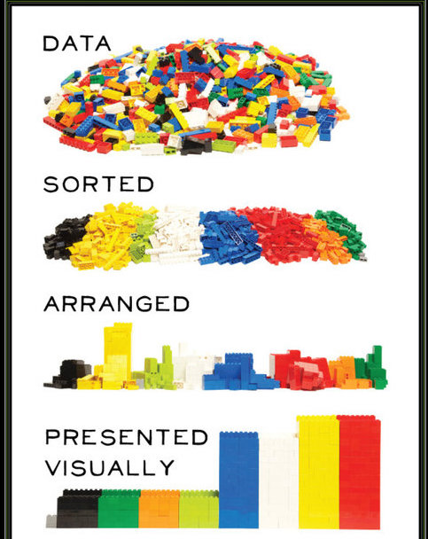
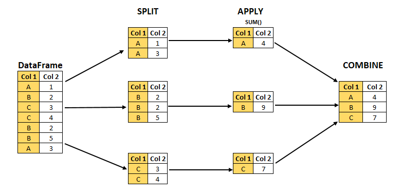

# Data manipulation {#manip}



In order to manipulate and wrangle data, there are (at least) 3 frameworks available :

- Base R (not covered) : similar to Pandas
- Tidyverse/dplyr : high level interface
- `data.table` : less friendly user interface but amazingly optimized

We'll cover the tidyverse approach as it provides a very nice and coherent framework for more than data manipulation. The "tidy" comes an original [paper from Hadley Wickham](http://www.jstatsoft.org/v59/i10/paper) which sets those common sense principles

- Each variable must have its own column.
- Each observation must have its own row.
- Each value must have its own cell.

You can check further details and visualization on the [R for data science online book](https://r4ds.had.co.nz/tidy-data.html)

Those principles have been largely adopted by the community (powered by Rstudio) and created a full parallel dialect in R for almost all data science tasks : the [**tidyverse**](https://www.tidyverse.org/) which offers a coherent set of features that are, in addition, often nicely optimized (written in C++)

## Import

### Text files

You can either use the basic `read.table` and related functions (eg `read.csv`) which work pretty fine. If the file is large, you might consider tools from other package such as read_csv and others from the `readr` package (part of the tidyverse)

```{r}
dat <- read.csv("Data/Sports/Activities.csv",header = T)
head(dat)
```

You have many options to deal with issues :

- `sep` to specify the separator (`\t` for tabulation, `';'` for semicolon... )
- `dec` the decimal separator
- `encoding` the file encoding (special characters from windows/unix systems can be misdetected)
- `colClasses` to force one column to be imported in another type than what is detected
- `help(read.table)` for more options !

### Excel files

You can import excel files (.xls and .xlsx) with the `readxl` package

```{r,warning=FALSE}
readxl::read_excel("Data/Sports/Activities.xlsx") %>% 
  head()
```

Options :

- `sheet` to select whioch you want to import
- `range` : the "zone" of the sheet you want to import (beginning and ending row/column to be provided)
- `col_types` to specify the types of the column if misdetected
- `?readxl::read_excel` for more information

### More formats

The `readr` package provides other convenient functions to read the most common (open) formats. With `haven`, you can also read data from proprietary formats (SPSS, SAS, Stat,...).

JSON files can be read with for example `rjsonlite` and we will use it in an applicaiton example.

XML and HTML files can be parsed with the `xml2`package.

### Read from databases / big data

This is a huge topic that we will only mention here, but for (almost) each database engine, there is a package available in order to be able to read data from databases

- General purpose : `odbc`, `RODBC`, `DBI` $\rightarrow$ you will need to install the DB's drivers
- Dedicated : `RSQLite`, `RPostgres`, `RMariaDB` (can be used for mySQL too)... $\rightarrow$ drivers included

With the 3 first package, you can connect to "monolith" databases, as well as to distributed databases. You can find more information on the [Rstudio website](https://db.rstudio.com/). Another interesting resources is the [`dbplyr` vignette](https://cran.r-project.org/web/packages/dbplyr/vignettes/dbplyr.html), that describes how to connect to a database and query it using `dplyr`'s verbs.

In addition, the `sparlyr` package allows you to interact with a spark cluster (using `dplyr syntax`)

## The grammar of data manipulation

**Alert :** After this section, pandas will appear much less appealing....


Following the tidy data principles, `dplyr` implements an  actual grammar of data manipulation with verbs and human-readable syntax.

### The pipe


The first operator to know is the *pipe* operator, `%>%` which allows you to redirect the output of a command "to the right" and hence  create readable chains of commands.
Let's extract the last 3 characters of "hello world" 

First solution : create useless objects

```{r}
char <- "hello world"
rev_char <- stringi::stri_reverse(char)
sub3 <- substr(rev_char,1,3)
stringi::stri_reverse(sub3)
```

Second solution : where's the beginning ????

```{r}
stringi::stri_reverse(substr(stringi::stri_reverse("Hello World"),1,3))
```

Third solution : using the pipe

```{r}
"Hello world" %>% 
  stringi::stri_reverse() %>% 
  substr(1,3) %>% 
  stringi::stri_reverse()
```

Under the hood : the dot represents the result of the previous step and can be placed somewhere else in the next function (rather than the first argument)

```{r}
"Hello world" %>% 
  stringi::stri_reverse(.) %>% 
  substr(.,1,3) %>% 
  stringi::stri_reverse(.)
```

### The verbs of manipulation

What do you do with data ?

- Select columns $\rightarrow$ `select()`
- Filter rows $\rightarrow$ `filter()`
- Create / modify columns $\rightarrow$ `mutate()`
- Compute summaries of the columns $\rightarrow$ `summarise()`
- Do group-wise operations $\rightarrow$ `group_by()`
- Join with other tables $\rightarrow$ `left_join()`,`right_join()`, `inner_join()`, `anti_join()`, `full_join()` 

I have the verbs, now I can associate them to make a sentence ! All those functions take as first argument a dataframe, which makes it very easy when chaining them with the pipe.

```{r}
read.csv("Data/Sports/Activities.csv") %>% 
  select(activityType,avgSpeed,distance,startLongitude,startLatitude,sportType) %>% #select some metrics
  mutate(distance=distance/100) %>% # distances are in decameter (?)
  filter(activityType!="other") %>% # remove activities "other
  group_by(activityType) %>% 
  summarise(total_dist=mean(distance))
```

### Filter : conditions

This is the way you write conditions in R :

Syntax            | Condition
------------------|----------------------------------------
==                |  Equality test
!=                |  Different than
%in%  c(...)      |  Is in this list of values
$>, >=$   $<, <=$ |  Greater/less than 
! (x %in% c(...)) |  Not in the list
&                 | And
\|                | Or

### Mutate

Most of the data manipulation will be done in a mutate statement. This is where you can create additional columns, modify the ones existing. You can do any kind of transformation you want with this one. Depending on the type of the data, here are some additional packages that will help you :

- `lubridate` to easily handle date variables
- `forcats` to handle factors (categorical variables)
- `stringr` (and `stringi`) to handle strings variables and work with regular expressions
- `ifelse()` and `case_when()` to handle conditional operations


```{r}
require(lubridate)
require(stringr)

dat <- dat %>% 
  mutate(start_time=as_datetime(startTimeLocal/1000), # create a timestamp
         date = floor_date(start_time,"day"), # round to the day
         is_bike=ifelse(activityType %in%
                          c("cycling","virtual_ride","indoor_cycling","road_biking","cyclocross"),T,F),
         # is it bike or not ?
         is_run = str_detect(activityType,"running|hicking"),
         activity_recoded = case_when(is_bike ~ "Bike",
                                      is_run ~ "Run",
                                      str_detect(activityType,"swim") ~"Swim",
                                      TRUE ~ "Other"))
```


### Summarize

This operation consists in summarizing several rows ofinto one or more synthetic value(s). We will cover the topic more in detail \@ref(stats) but the most common summary function that you can use are : 

- For continuous variables : average, sum, median, standard deviation, interquartile range (IQR), concentration indexes,...
- For categorical variables : count, count distinct, concentration indexes,...

Simple summary statistics over one numerical variable :

```{r}
dat %>% summarise(total_distance=sum(distance)) # Oups
dat %>% summarise(total_distance=sum(distance,na.rm = T))
dat %>% summarise(avg_distance=mean(distance,na.rm = T))
dat %>% summarise(median_distance=median(distance,na.rm = T))
```

### Join with other tables

Thanks to the `xxx_join(table_a,table_b)` functions you can combine several dataframes into one, matching the rows on chosen columns. 

- `left_join()` will keep the rows coming from table_a
- `right_join()` will keep the rows coming from table_b
- `inner_join()` will keep the rows present in both tables
- `full_join()` will keep the rows from both tables
- `anti_join()` will keep the rows from table_a that are not in table_b


### Manipulate several data in the same time

With all previous verbs above, you can use the `across` function to apply the same operation over a bunch of columns that you can select depending a simple enumeration or a condition (on their type or their name). This is a really powerful tool !

Example : we will convert all columns that are identifiers as character variables because the numbers have no meaning

```{r}
dat <- dat %>% 
  mutate(across(c(contains("Id"),contains("uuid")),
                as.character))
# Other stupid examples
dat %>%  summarise(across(where(is.numeric),
                          function(xx) sum(xx,na.rm=T)))
```


## Let's import and wrangle some data !

### The data

We will work on the summary data of all past activities, which come in JSON files. So basically, the data is contained in (nested) lists. This is real word data, it's super messy and dirty !
You will have to :

- Import the data 
    - Import one of the files using `jsonlite`
    - Inspect and understand the structure of the list
    - Get all the metrics that are included 
    - Figure out how to extract one specific metric for one activity
    - Design a function to extract one metric for all activities contained in the JSON
    - Design a function that will extract all metrics for all activities in the JSON
- Have a first cleaning of the data :
    - Check the distance/elevation variables ; what do you think ?
    - Check the speed related variables : what do you think ?
    - Check the calories variable and adjust it
    - Check the duration related variable and adjust them to have minutes
    - To help you figuring out, you can check an activity on garmin's site using [this url](https://connect.garmin.com/modern/activity/5570974040) and change the activity number for the one you are inspecting
    
A lot of reverse engineering ahead
    
### One tool you will need : `lapply()`

JSON are lists, and to iterate over list elements, you can either use `for` loops, which is highly *not recommended* (R is no good with loops), or use `lapply()`. This function applies an operation over all elements of a list (or vector) and returns a list containing the result. You can also use `sapply()` which tries to coerce the result to a vector (if possible) if the expected output is not a list.

```{r}
random_list <- lapply(1:100,function(xx) rnorm(100,xx,xx/5))
str(random_list[1:5])
```

**Attention :** be careful with the squared brackets

```{r}
random_list[1] # is a list
random_list[[1]] # is a vector
```


<!-- ## The split-apply-combine operation -->

<!--  -->


## Tidy your data

The data will almost never come in a ready-to-use format. Wrangling the data, beyond *cleaning* it also sometimes imply to *reshape* it so that it conforms to the tidy principles. For that you have 2 functions :

- `pivot_longer()` which will convert columns into rows
- `pivot_wider()`, the reciprocate operation, which will convert rows into columns

For example, we can chose that an observation is the combination of an activity and a metric. This representation can be useful in some cases (see \@ref(multivar)).

```{r}
dat_long <- dat %>% 
  select(activityId,where(is.numeric)) %>% 
  pivot_longer(-activityId,names_to="metric",values_to="value")
dat_long
```
With this format you can get summary statistics for all metrics also easily :

```{r}
group_by(dat_long,metric) %>% 
  summarise(mean_val=mean(value,na.rm=T))
```

And you you can go back to the original format if you want :

```{r}
group_by(dat_long,metric) %>% 
  summarise(mean_val=mean(value,na.rm=T)) %>% 
  pivot_wider(names_from = metric,values_from=mean_val)
```

The result looks very much like the one we had with `across` but the intermediate manipulationsncan be very useful in some cases. For instance, you could join the `dat_long` dataframe or its summary with an external data that has values by metrics (eg the average metric values for pro athletes).

