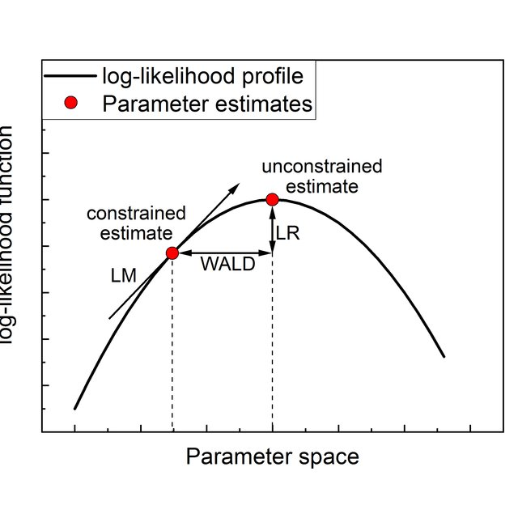

# Statistics {#stats}

Let's load and clean the data (which you have done during the exercises)

```{r,echo=FALSE}
source("ZZ2 - data_preparation.R")
```

This session aims to give a practical guide to explore a dataset you've never seen before and to understand some of the key statistical concepts. You will learn to describe each *variable* of a dataset and assess the strength of the relationship between two variables whatever their types may be. For that, we'll see how to visually explore a dataset and to quantify what the graphics show. We will also give an overview of what statistical inference is and what it can be used for.

This section covers the following topics :

- Definitions
- Descriptive statistics
    + Univariate statistics
    + Bivariate statistics

- Statistical inference :
    + The statistical model
    + Main theorems to be aware of
    + Introduction to statistical tests

## Definitions

### Terminology

A data set can be viewed in two different manners :

- A set of rows, or **statistical individuals**, aka observations (or instances in the galaxy of machine learning). This can be anything

- A set of columns, or **variables** that describe the individuals

It is crucial to have a good understanding of **what the statistical individual is**, and that can be challenging !

Some examples :

```{r}
head(dat)
group_by(dat,activityType) %>% 
  summarise(total_dist=sum(distance,na.rm=T),avg_speed=mean(avgSpeed,na.rm=T),avg_power=mean(avgPower,na.rm = T),
            .groups="keep") %>% 
  head()
group_by(dat,date) %>% 
  summarise(total_dist=sum(distance,na.rm=T),avg_speed=mean(avgSpeed,na.rm=T),avg_power=mean(avgPower,na.rm = T),
            .groups="keep") %>% 
  head()
```

### Types of variables

The way we analyse variables depends on their *type* :

- Numerical variables : 
- Continuous : income, revenue $\in \mathbb{R} , \mathbb{R}^+$ 
- Discrete : number of person per household $\in \mathbb{Z} , \mathbb{N}$
- Categorical variables :
- Ordered : small, medium, large
- Unordered : male, female

## Univariate statistics

### Numerical variables

#### Distribution

The distribution of a variable quantifies the number of individuals how have a certain value of the variable. We can visualize the distribution either with histograms or density plot, which are the "empirical counterparts" of the probability density function.

```{r}
ggplot(dat,aes(avgPower)) + geom_histogram() + theme_minimal()
ggplot(dat,aes(avgPower)) + geom_density() + theme_minimal()
```


#### Descriptive statistics

We typically want to measure what the "average" value is, along with "how diverse is my population". For that, we can use either sum-based statistics (mean, standard deviation) or quantiles.
Quantile-based statistics are said to be **robust** because much less sensitive to outliers. But they are more computationally expensive.

```{r}
stats <- c(quantile(dat$avgPower,1:3/4,na.rm = T),mean(dat$avgPower,na.rm = T))
ggplot(dat,aes(avgPower)) + geom_histogram() +
  geom_vline(xintercept = stats,color="red") + 
  annotate(geom = "text",x=stats,y=c(50,40,50,100),label=c("Q1","Q2=median","Q3","mean"),color="red") +
  geom_segment(aes(x=200,y=25,xend=300,yend=25),color="blue") +
  annotate(geom="text",x=300,y=30,label="dispersion",color="blue") + theme_minimal()
```


##### Central tendency

Central tendency statistics allow you to have an idea of the order of magnitude of the attribute you are interested in, over the population.

```{r}
summary(dat$avgPower)
quantile(dat$avgPower,probs=0:10/10,na.rm = T)
```


##### Dispersion

Dispersion describes how heterogenous our population is. It can be measured with various measurements (not exhaustive here)

```{r}
sd(dat$avgPower,na.rm = T) # standard deviation
IQR(dat$avgPower,na.rm = T) # interquartile range
sd(dat$avgPower,na.rm = T)/mean(dat$avgPower,na.rm = T) # coefficient of variation
```

How to read it :

- The average deviation to the average power is 29 watts
- The age difference between the rides in the 25% "less powerful" rides and the 25% "most powerful" rides is 37 watts
- The average deviation to the average power is 12% of the average power

The latter allows to compare dispersion between variables that have different units


#### Dealing with various shapes

The traditional example of a distribution is the gaussian distribution

```{r}
fake <- data.frame(xx=rnorm(100000,100,10))
ggplot(fake,aes(xx)) + geom_histogram() + labs(x="Random variable")+ theme_minimal()
```

In this case, we have a very interesting property : symmetry, which makes mean and median very close. If the coefficient of variation is not too high, the **tail** is pretty short.

In real life,it (almost) never happens. Therefore, to understand what happens, you can check :

- How different are mean and median
- Does a log transformation make the distribution "look better"
- Is it symmetric $\rightarrow$ skewness
- Is flat no not $\rightarrow$ kurtosis
- Is the distribution highly concentrated (few individuals get almost the whole cake) $\rightarrow$ concentration indexes (Gini, enthropy, Herfindahl...). You can check the package `ineq`
- Are there outliers (which generates a long tail) $\rightarrow$ outlier detection (vast field...). You can start with the previous

**Flat or not flat ?**

```{r}
data.frame(xx=rnorm(10000),yy=rnorm(10000,0,5))  %>% 
  pivot_longer(everything()) %>% 
  ggplot(aes(value,color=name)) + geom_density()+ theme_minimal()
```


```{r}
ggplot(dat,aes(distance)) + geom_histogram() + theme_minimal()
ggplot(dat,aes(distance)) + geom_histogram() + scale_x_log10() + theme_minimal()
```

#### Exercises :

What can you tell about the distance variable ?

- Draw the distribution of this variable. How much is the maximum distance of the 20% shortest activities ; the minimum distance of the 5% longest activities ? 
- What unit do you think it is ? Did you check the maximum value ?
- Is there more dispersion in the distance or the average power ? using the `facet_wrap` function of `ggplot2`, compare the distributions of distance and avgPower.
- I want to group activities in 5 categories based on the distance. This operation is called discretization (very useful for choropleth maps). Search for available methods, and apply some of them. Which one is best suited to this variable ? Which one should you avoid ?

### Categorical variables

#### Working with factors

Factors are an optimized way to store categorical variables (encoded in integers). The distinct categories are stored in the `level` attribute which you can interact with.

```{r}
as.factor(dat$activityType) %>% 
  levels()
as.factor(dat$activityType) %>% 
  str()
```

For more functionalities you can use the [forcats package](https://cran.r-project.org/web/packages/forcats/vignettes/forcats.html) which provides convenient tools (eg to recode the variable)

#### Barcharts

The barchart (which IS NOT a histogram) is the most common representation for categorical variables. You can also use the pie chart (but it requires to hack a little ggplot).
Pie charts are despised by the majority of statisticians but it can be adapted if the sizes really differ. Some material to make your own opinion :

- [Why it's bad](https://www.data-to-viz.com/caveat/pie.html)
- [Defense](https://www.oreilly.com/content/in-defense-of-the-pie-chart/)

```{r}
ggplot(dat,aes(activityType)) + geom_bar() + coord_flip() + theme_minimal()
ggplot(dat,aes(x="",fill=activityType)) + 
  geom_bar(width=1) + 
  coord_polar("y",start=0) + 
  theme_void()
```


#### Contingency tables

After visualizing, how can we measure the number of cases and the percent in each category ?

```{r}
table(dat$activityType)
table(dat$activityType) %>% 
  prop.table()*100 
```

Another solution is to use what you've learned in the previous section (\@ref()) : aggregation !

```{r}
group_by(dat,activityType) %>% 
  summarise(number=n(),proportion=n()/nrow(dat))
```


<!-- ### Weighted analysis -->


<!-- Let's say we want to compute the same proportions but for the whole country. As a statistician, I computed a weight for each customer so that the sum of weights equals the total population of Autria. -->

<!-- ```{r} -->
<!-- dat <- mutate(dat,weights = rnorm(nrow(dat),2,.7)) -->
<!-- ggplot(dat,aes(pop,weight=weights)) + geom_bar() -->
<!-- agg <- group_by(dat,pop) %>%  -->
<!--   summarise(number=sum(weights)) %>%  -->
<!--   ungroup() %>%  -->
<!--   mutate(proportion=number/sum(number)) -->
<!-- agg -->
<!-- ``` -->

<!-- **Exercice :** Reprensent and compute the proportion of women in the churn dataset. Create a weigth variable with mean 3 and standar deviation 2 and compare the results with the previous ones. -->

## Bivariate statistics

In this section, we see how to represent the relationship between two variables and measure it

### 2 continuous variables

#### Graphical exploration

To visualize the relationship between two numerical variables, we can use the scatter plot. Don't forget that the log function can help you identify non linear relationships since $log(a \cdot x^b) = log(a) + b \cdot log(x)$

```{r}
ggplot(dat,aes(distance,avgPower)) + geom_jitter() + 
  labs(x="Distance",y="Power",title="Raw variables") + scale_x_continuous(labels = scales::comma)+ theme_minimal()
ggplot(dat,aes(distance,avgPower)) + geom_jitter() + scale_x_log10(labels = scales::comma) + 
  labs(x="Distance",y="Power",title="Distance in log scale") + theme_minimal()
```

We can pimp up the graphics a bit to visualize the correlation

```{r}
ggplot(dat,aes(distance/1E5,avgPower)) + geom_jitter() + scale_x_log10(labels = scales::comma) + 
  labs(x="Distance",y="Power",title="Usage in log scale")+  geom_smooth(method="lm") + theme_minimal()
```

We can see here that there is a positive relationship between distance and data usage and that this relationship has an exponential shape, meaning that the usage increases A LOT when the age drops.


#### Quantifying the relationship : correlation**s**

To quantify this relationship, you can use the coefficients of correlation. There are 3 main coefficients : Pearson (the most famous and used), Kendall and Spearman. The latter can handle non-linear functional dependencies (ranks correlation) ; this is (roughly) equivalent to computing the coefficients on the log-transformed variables.

```{r}
# Pearson coeff
cor(dat$distance,dat$avgPower,method="pearson")
# Pearson coeff, NAs removed
cor(dat$distance,dat$avgPower,method="pearson",use = "complete.obs")
# Spearman coeff 
cor(dat$distance,dat$avgPower,method="spearman",use = "complete.obs")

# Why is R a beautiful language ? Do it at once, without loops (loops are evil) 
print("all coeffs")
sapply(c("pearson","spearman","kendall"),function(xx) cor(dat$distance,dat$avgPower,method=xx,use = "complete.obs"))
```

More [info about correlation coefficients](https://www.statisticssolutions.com/correlation-pearson-kendall-spearman/)

Should there be a complex relationship (eg sine), the graphical exploration is mandatory !

### 2 categorical variables

For this part, I will create a discrete variable out of the distance variable (see previous exercises) to use it as second qualitative variable (the other ones are not really meaningful)

```{r}
dat <- mutate(dat,qual_distance=as.character(cut(distance,
                                                 quantile(distance,probs = 0:5/5,na.rm=T),
                                                 include.lowest = T,
                                                 labels=c("Very short","Short",
                                                          "Average","Long","Very long"))),
              qual_avgHr=as.character(cut(avgHr,quantile(avgHr,0:3/5,na.rm = T),
                                          include.lowest = T,
                                          labels=c("Low intensity","Average intensity",
                                                   "High intensity"))),
              qual_distance=ifelse(is.na(qual_distance),"Very short",qual_distance))
```

Try different layouts with you barcharts !

#### Barcharts

```{r}
ggplot(dat,aes(activity_recoded,fill=qual_distance)) + 
  geom_bar(position = "stack") + theme_minimal()
ggplot(dat,aes(activity_recoded,fill=qual_distance)) + 
  geom_bar(position = "dodge") + theme_minimal()
ggplot(dat,aes(activity_recoded,fill=qual_distance)) + 
  geom_bar(position = "fill") + 
  scale_y_continuous(labels = scales::percent) + theme_minimal()
```

You get really different insights depending on the representation you chose !

#### Contingency tables

```{r}
table(dat$activity_recoded,dat$qual_distance) 
table(dat$activity_recoded,dat$qual_distance) %>%   
  prop.table()*100
table(dat$activity_recoded,dat$qual_distance) %>%   
  prop.table(margin = 1)*100
table(dat$activity_recoded,dat$qual_distance) %>%   
  prop.table(margin = 2)*100
```

<!-- ### Weighted contingency tables -->

<!-- If you have a weighting variable, you can create a weighted contingency table with the following function.  -->

<!-- ```{r} -->
<!-- tab <- xtabs(weights~pop+gender,data=dat) %>% prop.table() *100 -->
<!-- tab -->
<!-- ``` -->

<!-- It is,again, strictly equivalent to aggregating the weighting variable by `pop` and `gender`. But the previous object can be used as input for the $\chi^2$ and Cramer's V functions (or plot as well) -->

<!-- ```{r} -->
<!-- group_by(dat,qual_distance,gender) %>%  -->
<!--   summarise(nb=sum(weights)) %>%  -->
<!--   ungroup() %>%  -->
<!--   mutate(pct = 100*nb/sum(nb)) -->
<!-- ``` -->

#### Quantifying relationships : $\chi^2$, Cramer's V

The Chi-square ($\chi^2$) statistics is used to measure the distance between the actual distribution of cases among categories of both variables and the distribution if the variables were independant. The higher the `X-squared`, the higher the divergence with independance, meaning that the variables are likely *linked* (correlation does not apply to categorical variables). The `p-value` indicates whether this relationship is **statistically significant** or not. We will see this in more details in the last chapter (Inference).

More info and detailed way to compute the value : [this website](https://www.statisticshowto.com/probability-and-statistics/chi-square/)

#### Extreme examples :

Let's assume we want to assess the relationship between gender and churn. Further assumption, we have 100 customers, 50 males, 50 females on the one hand, 50 churners, 50 non churners on the other hand. 

- If the variables are independent, the cross table would look that way :

```{r,echo=FALSE}
ex_indep <- matrix(100/16,n_distinct(dat$activity_recoded),n_distinct(dat$qual_distance))
rownames(ex_indep) <- unique(dat$activity_recoded)
colnames(ex_indep) <- unique(dat$qual_distance)
ex_indep %>% chisq.test()
```

- In the opposite situation (full dependency), the contingency table would look like that :

```{r,echo=FALSE}
ex_dep <- diag(100/4,n_distinct(dat$activity_recoded),n_distinct(dat$qual_distance))
rownames(ex_dep) <- unique(dat$activity_recoded)
colnames(ex_dep) <- unique(dat$qual_distance)
ex_dep[,-5] 
```

The $\chi^2$ statistic measures the "distance" between reality and the first case (independence)

**Note :** if some cells of the contingency table have less than 5 cases, the statistic is not reliable (you'll get a message in this case)


The chi-square suffers 2 main drawbacks : its value depends on the number of observations and the total number of categories $\Rightarrow$ one cannot compare the $\chi^2$ values for 2 different tables that have different numbers of underlying observations and number of categories.
To deal with that, you can use Cramer's V, which is a (kind of) *normalized* $\chi^2$. You can use the function built in the `lsr` package. Cramer's V $\in [0,1]$ and the higher it is, the more intense the link between both variables.

```{r}
# install.packages("lsr") # If not installed
table(dat$activity_recoded,dat$qual_distance) %>% 
  lsr::cramersV()
```

Let's check with our 2 extreme examples :

```{r}
lsr::cramersV(ex_dep[,-5])
lsr::cramersV(ex_indep)
```

In practice, it is very rare to get high values ; a rule of thumb is that a value around 0.2-0.3 is already "decent". The $\chi^2$ p-value (if under 0.05) shows that there is a relationship ; Cramer's V allows to compare between two tables.

### 1 continuous, 1 categorical variable

In this part, we see how to deal with 2 variables that have different types. The goal remains the same : getting insights about the relationship between those 2 variables and quantify the strength of the link.
We will try to assess if there is a connection between the distance and the discipline.

#### Boxplots, violin plots

Boxplots are a simple, effective and compact representation of a variable's distribution. It relies on quantiles.
Vilin plots allows to see the ful distribution of both variables
```{r}
# Compute bounds of the boxplot
# bounds <- group_by(dat,activity_recoded) %>% 
#   summarise(q1=quantile(distance,.25,na.rm = T),
#             q2=quantile(distance,.50,na.rm = T),
#             q3=quantile(distance,.75,na.rm = T),
#             lower_bound=q1-1.5*IQR(distance,na.rm = T),
#             upper_bound=q3+1.5*IQR(distance,na.rm = T)) %>% 
#   pivot_longer(-activity_recoded)
ggplot(dat,aes(activity_recoded,distance/1E5)) + geom_boxplot() + theme_minimal()
  # geom_point(data = bounds,aes(activity_recoded,value,color=name))
ggplot(dat,aes(activity_recoded,distance/1E5)) + geom_violin()+ theme_minimal() + scale_y_log10(label=scales::comma)
```

It looks like bike activities are longer than the others ! Big surprise !

#### Quantifying relationship intensity : $\eta^2$

The graphics indicate that there is a relationship between activity type and distance (if not, boxplots would have the same shape for all groups). We can assess the strength of the connection with the $\eta^2$ statistics. 

Using the decomposition of the variance formula $SS_{total} = SS_{between} + SS_{within}$, $\eta^2$ is defined as $\eta^2 = \dfrac{SS_{between}}{SS_{total}} \in [0,1]$

#### Extreme examples :

- If the variables are independent, the boxplots should look like this (almost no difference in the distributions) : 

```{r,echo=FALSE}
data.frame(activity_recoded=factor(sample(unique(dat$activity_recoded),size = 1000,T)),distance=rnorm(1000,1,200)) %>% 
  ggplot(aes(activity_recoded,distance)) + geom_boxplot() + theme_minimal()
```

- If they are fully "correlated", the activity variable would explain all variance in the data set :

```{r,echo=FALSE}
data.frame(activity_recoded=factor(rep(unique(dat$activity_recoded),100)),distance=rep(c(1,15,65,100),100)) %>% 
  ggplot(aes(activity_recoded,distance)) + geom_boxplot() + theme_minimal()
```

In this case, we see that all the variance lies between the subgroups : there is no dispersion within the groups.

**Note :** In practice, the previous situation will of course never happen, and a categorical variable can't carry by itself a lot of variance (since the number of possible values are de facto limited).

This is also the $R^2$ of the 1-factor ANOVA regression of distance explained by activty type,

```{r}
anova <- aov(distance~activity_recoded,data=dat) 
# Variance decomposition
summary(anova)
print("eta squared")
lsr::etaSquared(anova)
# Alternatively
lm(distance~activity_recoded,data=dat) %>% summary()
```

In this case, 11.2% of the age variance is explained by the difference in activity types ; it is very high.

### Exercises

- Explore the distribution of the average speed. What can you say about it ?
- Explore the correlation between average speed and average power
- For all the the categorical variables, get the frequent category (with table AND dplyr/tidyr)

**Very important :** For the next parts, we will remove the extreme observation that is clearly an error

```{r}
dat_clean <- filter(dat,!(activityId %in% c(407226313,2321338)) & year(date)>=2012)
```


## Statistical inference {#stat_inf}

### The statistical model

We want to measure a characteristic in the *general population*, let's say the average distance of all potential activites, and let's denote it by D.

The fundamental assumption of the statistical model is that there is an underlying *data-genereting process*, which means that D is distributed with a certain probability distribution. The goal of the statistician is to find which distribution it is, and estimate its parameters. 
<!-- To simplify, we'll assume that $U \hookrightarrow \mathcal{N}(\mu,\sigma)$ where $\mu, \sigma$ are the *population parameters*. -->

The big problem is that it is impossible to observe D on the whole population, and any dataset is only a **sample of the general population** (which does not really exists). The question is then : how can we estimate the parameters of the *true* distribution ?

$\Rightarrow$ There is a difference between the **sample mean** and the **population mean** (noted $\mu$).
As a matter of fact the sample mean is an estimator of the population mean. The value of an estimator (often noted $\hat{\theta}$) is a random variable (it depends on the sample), meaning this is not a single deterministic value, but has a probability distribution. Therefore it has an **expectation** and a **variance**
An estimator is said to be *biased* if $\mathbb{E}(\hat{\theta}) \neq \mu$ ; it is said to be *efficient* if its variance is minimal.

One fundamental hypothesis of the model is that all observations are independent and identically distributed (*iid*). This is typically not the case for *time series*, but this hypothesis is, in general, reasonable.

### Two fundamental theorems

Eventough we cannot observe the true parameter(s), and that the sample mean is an estimator (hence a random variable), 2 theorems save the game :

#### The law of large numbers

$$\bar{D} = \dfrac{1}{n} \sum_{i=1}^n D_i \xrightarrow[n \to +\infty]{a.s.} \mu$$

In other words, when the sample size n is big enough, the sample mean converges to the population mean $\rightarrow$ We can estimate this parameter with a simple mean without **bias**.

#### The central limit theorem (CLT)

Probably the most important theorem in statistics, valid whatever the true distribution is 

$$\sqrt{n} \cdot \bar{D} \xrightarrow[n \to +\infty]{p}  \mathcal{N} (\mu,\sigma^2)$$

Meaning that the sample mean converges in probability to a normal distribution with population parameters at "speed" $\sqrt{n}$. This is equivalent to :

$$ \bar{D} - \mu \xrightarrow[n \to +\infty]{p}  \mathcal{N} (0,\frac{\sigma^2}{n})$$

Meaning that : 

- I can quantify "how far" my sample mean is from the true value
- The larger the sample size, the smaller the average deviation to the true value $\rightarrow$ the variance of my estimator reduces when the sample size increases.

```{r,echo=FALSE}
mu <- 10
sigma <- 3
n <- 10^(1:4)
sim <- lapply(n,function(xx) data.frame(n=as.character(rep(xx,xx)),
                                        U=rnorm(xx,mu,sigma/sqrt(xx)))) %>% 
  bind_rows()
ggplot(sim,aes(U,color=n)) + geom_density() + 
  geom_vline(xintercept = 10.5,color="red") +
  annotate(geom="label",x=10.7,y=10,label="Sample mean \nestimate",color="red") + theme_minimal()
```


Take away :

- The **sample mean** is an **estimator** of the true value of an underlying "true" mean. The estimator's value depends on the sample I have
- This estimator (any estimator) has a **variance** that I could measure if I had several samples to compute several sample means
- Probality theory gives us tools to estimate the **bias** and **the variance** of an estimator
- **Bias-variance trade-off** :$\mathbb{E}((D-\bar{D})^2)=\mathbb{E}^2(D-\bar{D}) + \mathbb{V}(\bar{D})$, in other words : $MSE_{\bar{D}} = bias^2 + \mathbb{V}(\bar{D})$  $\rightarrow$ see you during ML course ;-)

Illustration of the biais-variance trade-off.

Let's assume the **true** average of the usage is 10, what do you prefer over the following scenarios ? Let's simulate two distributions (let's say it is the distribution of 2 different estimators) :

- One with mean 10 and variance 4 $\rightarrow$ unbiased
- The second with mean 10.5 and variance 1 $\rightarrow$ biased but with low variance

```{r,echo=FALSE}
data.frame(unbiased=rnorm(100000,10,4),low_variance=rnorm(100000,10.5,1)) %>% 
  pivot_longer(everything()) %>% 
  ggplot(aes(value,color=name)) + geom_density() +
  geom_vline(xintercept = 10,color="purple",linetype=3,size=2) +
  annotate(geom="label",x=13,y=.45,label="True mean",color="purple")  + theme_minimal()
```

In the first case, the estimator is unbiased, but with a higher variance than the second : if we go for it, we take the chance to have an estimate (depending on our sample) of eg 15 or 5, which is almost unlikely to happen with the second estimator, although this second is not centered on the true value.
It is up to you to decide, but you generally can't have both an unbiased and very precise estimator... 

### Statistical tests

#### Introductory example

Knowing the theoretical probability distribution of our estimator, we can assess the likelihood of an hypothesis. For the example, let's make the hypothesis ($\mathcal{H_0}$) that the true mean is 10 and standard deviation is $2\sqrt{n}$. If this hypothesis is true, thanks to the CTL, the distribution of $\bar{D}$ would be the following :

```{r,echo=FALSE}
sim <- data.frame(gauss=rnorm(100000,10,2)) 
sim %>% ggplot(aes(gauss)) + geom_density() +
  geom_vline(xintercept = 10-2*1.96,linetype=4,color="red") + 
  geom_vline(xintercept = 10+2*1.96,linetype=4,color="red") +
  annotate(geom="label",x=10,y=.05,label="95% of all possible values \nfor the sample mean \nunder H0",color="red")  + 
  theme_minimal()
```

Now, I can compute my sample mean and check its value against the hypothetical distribution :

```{r,echo=FALSE}
sim %>% ggplot(aes(gauss)) + geom_density() +
  geom_vline(xintercept = 10-2*1.96,linetype=4,color="red") + 
  geom_vline(xintercept = 10+2*1.96,linetype=4,color="red") +
  annotate(geom="label",x=10,y=.05,label="95% of all possible values \nfor the sample mean \nunder H0",color="red") +
  geom_vline(xintercept = 15,color="purple",linetype=5) + 
  annotate(geom = "label",x=16,y=.1,label="Sample mean",color="purple") +
  annotate(geom = "label",x=16.2,y=.07,label=paste("proba",round(pnorm(15,10,2,lower.tail = F),4)),color="purple")  + 
  theme_minimal()
```

Obviously my actual value doesn't fit with my hypothesis : the probability of getting such a sample mean under $\mathcal{H_O}$ is very small $\rightarrow$ my hypothesis is very unlikely to be valid $\rightarrow$ the true mean is probably not 10.

#### Student test

A test is defined by its *null hypothesis* $\mathcal{H_0}$, the contrapositive (alternative) being $\mathcal{H_1}$. The general procedure is to set $\mathcal{H_0}$ such that we can build a *test statistic* of which we can derive the distribution.

In general, statisticians chose a null hypothesis such that they can build a statistic for which they know the distribution $\rightarrow$ they can compute the probability of a specific value to occur.

For the example, we'll focus on the **Student test**. The test is meant to check whether the true value of the mean is equal to a specific value. Example, I want to test whether the average distance for all activities is 20km/h. Our test is the following :

- $\mathcal{H_0}$ : The average distance of activities is 20
- $\mathcal{H_1}$ : The average distance of activities is not 20

The next important parameter of a test if $\alpha$, the risk level, meaning the probability we are willing to take to be wrong while accepting $\mathcal{H_0}$. 5% is a value that is often chosen.

Thanks to the CLT, we can build the following test statistic :

$$T = \sqrt{n} \dfrac{\bar{D}-20}{\sigma} \hookrightarrow \mathcal{N}(0,1)$$

Problem : we don't know the value of the true standard deviation. The final test statistic is distributed with a Student distribution :

$$T = \sqrt{n} \dfrac{\bar{D}-20}{\hat{s}} \hookrightarrow \mathcal{St}_{n-1}$$

where $\hat{s}^2 = \dfrac{1}{n-1}\sum_{i=1}^n (D-\bar{D})^2$ is the unbiased estimator of the variance.

##### Implementation in R :

```{r}
t.test(dat$distance,mu=20)
```

##### Interpretation :

If you have one thing to remember : **the p-value is the probability to be wrong while rejecting $\mathcal{H_0}$**. 
In our case, this probability is very small, meaning that we should not consider that the average distance of all activities is 20km/h.

In short : all you have to know is what the null hypothesis is, and make your decision depending on the p-value. In general, we reject the null is p-value < 5% (the risk level), but you can decide to be more demanding and chose a lower threshold if you don't want to make a mistake.

*Note : * If you want to dig deeper, you can test whether the mean is strictly greater than a specific value using the parameter `alternative` of the `t-test` function.

#### Student test to compare group means

You can also use the Student test to check whether the means of two sub-populations are equal or not. In this case, the tests checks whether the difference in means differs significantly from 0. We'll check in this example if average distance differs between rides and other activities.
For that we have to extract on the one hand the bike activities' distance and the other activites' distance on the other hand. We can run the test on those 2 vectors :

```{r}
bike <- filter(dat,is_bike) %>% pull(distance)
non_bike <- filter(dat,!is_bike) %>% pull(distance)
t.test(bike,non_bike)
```

In this case, the null hypothesis is "the difference in means is 0" and the p-value is very very small (almost 0) $\rightarrow$ we can reject the null without second thoughts, which means there is a **significant** difference between the 2 sub-groups regarding average distance.

#### Back to our $\chi^2$

Remember the $\chi^2$ test is used to assess if 2 categorical variables are independent or not. The null hypothesis in this test is "both variable are independant". To check that, a test statistic, $D^2$ (X-squared in R output) is built, and under $\mathcal{H_0}$, it is distributed with a $\chi^2$ probability distribution. We can can then test the validity of the null depending on the test value.

Let's check if there is a relationship between activity and distance in bins :

```{r}
tab <- table(dat$qual_distance,dat$activity_recoded) 
tab

tab %>% chisq.test()
```

In this case, the p-value is again much smaller than 5% $\Rightarrow$ the probability to be wrong by rejecting the null is again very small... It is hence reasonable to reject the null and we can consider that the two variables are independent, meaning there is a connection between the activity type and the distance.

### Other estimators : maximum of likelihood

We saw that the sample mean is a good estimator for the population mean. If you assume that the underlying probability distribution of the variable of interest is something else than a normal distribution, you can be interested in estimating another parameter than the mean.

Let's say we want to estimate the $s$ parameter of the [Zipf's law](https://en.wikipedia.org/wiki/Zipf%27s_law).

In this case, you can use the **maximum likelihood estimator** (MLE). The [likelihood](https://en.wikipedia.org/wiki/Likelihood_function) is the joint probability of observing the sample I got (which is the product of individual probabilities under the iid hypothesis). 

$$L_X(s) = \prod_{i=1}^n f(k;s,N)$$

Since we state that the underlying probability distribution is Zipf's law, we can express the likelihood as a function of the $s$ parameter. The idea of the MLE is since this sample happened, it was the *most likely* to happen, hence the value of $s$ is such that it maximizes the likelihood for my sample. And finding the maximum value is something for which we have a few algorithms !

For this estimator, we also know some asymptotic properties that allows to build tests, which you can interpret in the same manner. Namely, you have three tests :

- Wald test
- Likelihood ratio test
- LM test (Lagrange multiplier)



All those test statistics are distributed as a $\chi^2$ distribution

MLE is also used for machine learning/econometrics, especially when relationships are non linear $\Rightarrow$ logistic regression.

**Notes :** 

- Sample mean is the MLE for the exponential family (eg gaussian distribution)
- MLE is a subset of [M-estimators](https://en.wikipedia.org/wiki/M-estimator)

### Exercises : interprete a test you don't know

- Run a Kolmogorov–Smirnov test on the distance variable, and the logarithm of this variable. What can you conclude ?
- In time series analysis, it is crucial to check if a time series is stationary or not. Stationarity means that both mean and variance are constant over time (no drift). If it's the case, it's easier to model it.
To check that, there are several tests called "unit-root" tests (if there is a unit root, the serie is not stationary).
In this example, I simulate a time series and run the Phillips-Perron test. The alternative hypothesis is specified in the output ; please interpret the result.

```{r}
library(tseries)
# generation of a random walk
Xt <- cumsum(rnorm(100))
plot(Xt,type="l",main="Random time serie",col="blue")
pp.test(Xt)
```