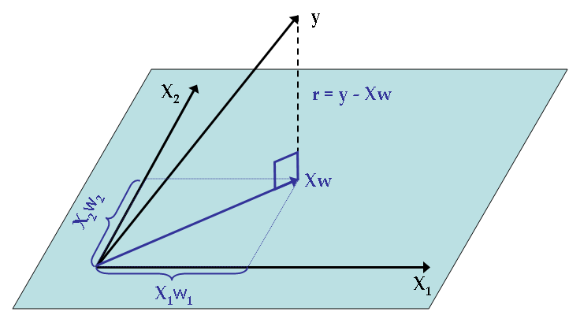

# Linear and logistic regression {#reg}

Regression is the first machine learning algorithm. It allows you to model a *target variable* $y$ depending on a set of *explanatory variables* or *features* $X$ such that $y=f(X) + \epsilon$ where $f$ is a linear function (for linear regression).

## Linear regression

We will jump directly to the *multiple regression model*, which is the generalization of the simple linear model, which you can check [here](https://www.econometrics-with-r.org/4-lrwor.html)

### General presentation

The basic equation of the linear regression is 
$$ y_i = x_i \cdot b + \epsilon_i \Leftrightarrow y_i = \sum_{j=1}^p x_{ij} b_j + \epsilon_i$$

Where :

- $x_i$ is a row-vector of size p (number of explanatory variables), containng the values of each feature of observation i. It is the row i of the matrix $X = (x_{ij})$
- b is a column-vector of coefficients, one per explanatory variable
- $\epsilon_i$ is the error term for observation i

This regression is said to be linear because it is *linear in the parameters*, you can however transform the original variables at will with non-linear functions (see feature engineering).

The biggest assumptions of this model are :

- Observations are iid
- There is no perfect multi-collinearity among features
- $\epsilon_i$ has a zero conditional mean $\mathbb{E}(\epsilon | X)=0$ 

This last condition helps us to derive an estimator for b (which can be derived in several ways) which is called the OLS estimator (Ordinary Least Squares), which is the solution of the optimization program : 

$$\hat{b}=argmin_b \sum_{i=1}^n \epsilon_i^2 = argmin_b \sum_{i=1}^n (x_i-x_i \cdot b)^2$$

The solution is $\hat{b} = (X'X)^{-1}X'y$ where $X'=t(X)$. $(X'X)^{-1}X$ is the projection matrix over the hyperplane defined by the features.


### Implementation and diagnostics

To implement a linear regression with R, we use the lm function :

```{r}
reg <- lm(avgSpeed~avgPower + avgBikeCadence + distance + avgHr + max20MinPower, data=dat_bike)
summary(reg)
```
The goodness of fit is measured through 2 main statistics :

- Adjusted R-squared, $1- \dfrac{n-1}{n-k-1} \dfrac{SSR}{TSS} \in [0,1]$, which takes the number of regressors into account. The closer to 1, the better the fit
- RMSE (root mean squared error), or residual standard error which has to be compared to the average value of $y$. the smaller the value, the better the fit.

### Coefficients interpretation and inference

Back to original equation, we can understand how much each feature influences in average the output. 

$$ \dfrac{\partial y}{\partial x_1} = b_1$$
Meaning that the increase of $x_1$ by one unit causes the output to increase in average by $b_1$ (which can of course be negative). In our example, one additional watt will result in an increase of the average speed by 0.25 km/h

The fundamental hypothesis being fulfilled and the sample being large enough, the distribution of the OLS estimate $(b_1,...,b_p)$ are jointly normally distributed, meaning that each $\hat{b_j} \hookrightarrow \mathcal{N}(b_j,\sigma_{b_j}^2)$
We can therefore perform statistical tests following the previous methodology (see \@ref(stat_inf).

The most common test is the Student test which tests the null hypothesis $b_i=0$. This allows to check whether a regressor has a significant effect on the target variable or not.

But you have to check your residuals !

```{r}
residuals(reg) %>% 
  data.frame(res=.) %>% 
  ggplot(aes(res)) + geom_density() + theme_minimal()
```
Those are pretty long tailed, which might reflect some outliers or a wrong functional specification !

### The Frisch–Waugh Theorem and the omitted variable bias

The [Frisch-Waugh theorem](https://en.wikipedia.org/wiki/Frisch%E2%80%93Waugh%E2%80%93Lovell_theorem) tells us that adding a variable as regressor ensures that our estimates controls for the effect of this variable. In other words, you can interpret the coefficients' values *ceteris paribus* (other things equal).

This also means that if you omit a variable, the coefficient of the other variables are likely to be biased, because you did not take an important variable into account. Back to our example, we can add the elevationGain variable and check what happens :

```{r}
reg <- lm(avgSpeed~avgPower + avgBikeCadence + distance + avgHr + max20MinPower + elevationGain, data=dat_bike)
summary(reg)
```

See how the coefficients changed. This is understandable because when climbing mountains :

- More power will not increase the speed, just maintain it (... or not)
- The cadence is harder to maintain unless you have unlimited gears !
- The surprising negative effect of the max20MinPower is no more

Notice though that the RMSE and the adjusted $R^2$ degraded... See the variable selection to see how to mitigate that problem.

### Feature engineering and functional specification

The omitted variable bias makes it very important to include as much variables as possible if you want to be able to estimate the coefficient as accurately as possible. What you can do is add :

- Exponents to the regressors 
- Interactions between regressors

Example with 2 variables $y=b_1x_1 + b_2x_2 + b_3x_1^2 + b_4x_1x_2 + \epsilon$

In this case : $\dfrac{\partial y}{\partial x1} = b_1+2b_3x_1+b_4x_2$

```{r}
reg <- lm(avgSpeed~ avgPower + I(avgPower^2) + avgBikeCadence + 
             distance + I(avgPower*distance)+  avgHr + max20MinPower , data=dat_bike)
summary(reg)
```

```{r}
reg_full <- lm(avgSpeed~(avgPower + avgBikeCadence + distance + avgHr + max20MinPower + elevationGain)^2, data=dat_bike)
summary(reg_full)
```

### Variable selection

So far we focused on getting the best coefficient estimates to be able to interpret how features impact our target variable ("explainable AI"), but following the previous logic, adding the more feature the better ! However, when focusing on the best prediction, you are more interested in finding the most general model which will perform well *out of sample* adding more and more variables can lead, as a matter of fact, to an overfitted model, which will hardly generalize.

This is illustration of the bias-variance trade-off which you will see more in depth during the machine learning session.


Regarding regression, avoiding overfitting can be done with variable selection : starting from an extensive model, the procedure will try every feature combination that leads to the best prediction. There are 3 ways of constructing the models :

- backward selection : remove the less useful feature at a time
- forward selection : introduce the most useful feature at a time
- stepwise selection : a mixture of the previous methods

The quality of each model is determined by the [AIC](https://en.wikipedia.org/wiki/Akaike_information_criterion) or [BIC](https://en.wikipedia.org/wiki/Bayesian_information_criterion) which are a function of the opposite of the log-likelihood (because OLS can also be estimated with MLE) and the number of parameters. The lower this number, the better the model.

We can implement this method easily

```{r}
selection <- step(reg_full)
summary(selection)
```


### Exercises

- From the last functional form used, design a graphic that shows the final impact of an increase in power to the average speed, taking the distance into account.
- Design a regression model that will predict best the theoretical average speed for indoor bike activities (that have no speed, no coordinates...)
- Develop a model that will help you identify the measurement errors (thanks to residuals)

## Logitic regression

### Mathematical formulation

Logistic regression aims to model a *binary* output. In this case, $y \in \{0,1\}$ and the previous specification can't apply. We still have a linear relationship, but which applies to the log-odd ratio :

$$log \dfrac{\mathbb{P}(y=1|x)}{1-\mathbb{P}(y=1|x)} = log \dfrac{^p}{1-p} = x_ib + \epsilon_i$$

This is called the **link function** and working the  expression further we find that : $p(x_i;b) = \mathbb{P}(y_i=1|x_i) = \dfrac{1}{1+e^{-x_ib}}$

This allows us to derive the likelihood :

$$\mathcal{L}(b) = \prod_{i=1}^n p(x_i;b)^{y_i} \cdot (1-p(x_i;b))^{1-y_i}$$

This expression can be simplified, but there is no exact expression as for the OLS $\rightarrow$ the optimal solution has to be found via numerical optimization (eg Newton-Raphson).

### Implementation in R and interpretation

In R, we use the `glm` function while specifying the family. We model the probability of an activity to be bike or something else, which is a binary variable.

```{r}
logit <- glm(is_bike~distance+duration+elevationGain+avgSpeed+avgHr,data=dat_clean,family = "binomial")
summary(logit)
```

The sign of the coefficient indicates whether the feature increases the probability for an activity to be a ride ride or not. However, the values cannot be interpreted as directly as in the case of the linear regression. But you can use the exponent of the value of the coefficient and interpret it in terms of odd-ratios. 
For instance, adding one more kilometer to the average distance multiplies the probability for an activity to be a ride *rather than anything else* by `r exp(logit$coefficients["distance"])`, meaning 4% more chances. In the contrary, an activity that has 1 bpm more than the average HR has `r 100*(1-exp(logit$coefficients["avgHr"]))` 6% less chances to be a ride. This makes sense because, as observed earlier, rides are longer and the heart rate is a bit smaller than for other activities.


### Goodness of fit

As you might have noticed, there is no $R^2$ or RMSE in our case, just the AIC (which only allows you to compare different models, not know how good the model is). What we can do is check the fitted values of the model and the actual values

```{r}
pred <- predict(logit,dat_clean,type="response")
pred_bin <- as.numeric(pred>.5)
table(pred_bin,dat_clean$is_bike)
```

And we can compute the accuracy as the sum of correct predictions divided by total number of activities : `r (1418+1241)/(1418+1241+133+413)`
You can derive other goodness of fit metrics from the previous **confusion matrix** :

- Sensitivity (recall) : $\dfrac{TP}{TP+FN}$
- Specificity : $\dfrac{TN}{TN+FP}$
- Precision : $\dfrac{TP}{TP+FP}$


Depending on your business use case, you will focus more on one or the other metric. You will cover this in more detail durinng the machine learning week :)
